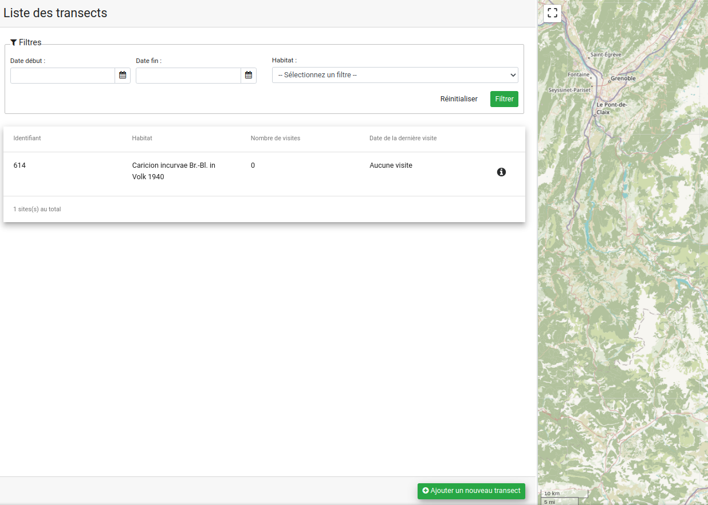

# Suivi Habitat Station

Module GeoNature de suivi des habitats sur une station, piloté par le CBNA.

## Documentation

- [Installation et désinstallation du module](./docs/install.md)
- [Import des données](./docs/imports_data.md)

## Licence

* [Licence OpenSource GPL v3](./LICENSE.txt)
* Copyleft 2018-2023 - Parc National des Écrins - Conservatoire National Botanique Alpin

