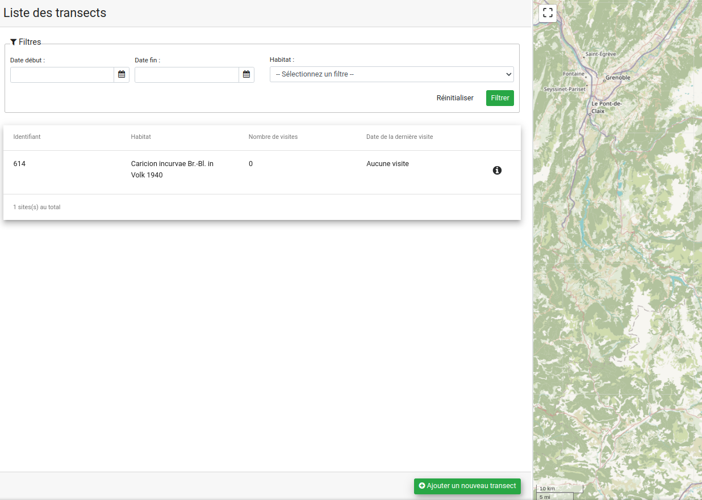

# Suivi Habitat Station

Module GeoNature de suivi des habitats sur une station, piloté par le CBNA.

## Documentation

- [Installation et désinstallation du module](./docs/install.md)

## Licence

* [Licence OpenSource GPL v3](./LICENSE.txt)
* Copyleft 2018-2020 - Parc National des Écrins - Conservatoire National Botanique Alpin

## Installation

### Installation en mode développement

* Cloner le module avec le protocole SSH : `git clone git@github.com:PnX-SI/gn_module_monitoring_habitat_station.git`
* Placez-vous dans le dossier de GeoNature et activez le *venv* : `source backend/venv/bin/activate`
* Installez le module dans GeoNature avec la commande : `geonature install-packaged-gn-module --build false /home/${USER}/modules/gn_module_monitoring_habitat_station MHS`
  * Réinstaller le paquet Python pour tenir compte des dépendances de développement : `pip install -e /home/${USER}/modules/gn_module_monitoring_habitat_station[dev]`
* Complétez la configuration du module uniquement si nécessaire : `nano config/conf_gn_module.toml`
  * Vous trouverez les paramètres possibles dans le fichier : `config/conf_gn_module.toml.example`.
  * Les valeurs par défaut dans : `backend/gn_module_monitoring_habitat_station/conf_schema_toml.py`
* Mettre à jour le frontend : `geonature update-configuration --build false && geonature generate-frontend-tsconfig && geonature generate-frontend-tsconfig-app && geonature generate-frontend-modules-route`
* Vous pouvez sortir du venv en lançant la commande : `deactivate`

